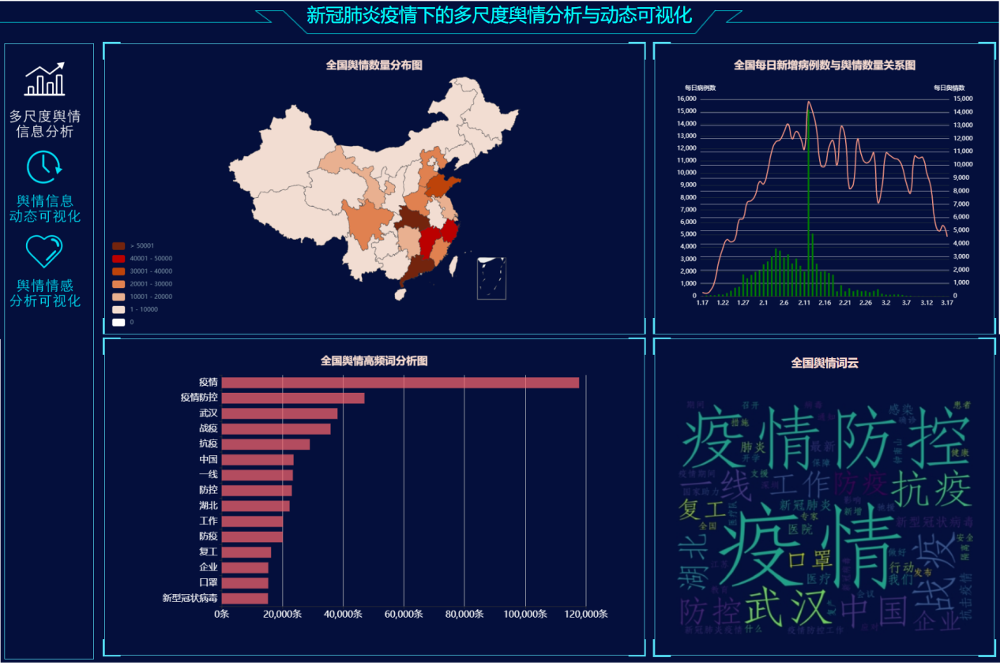
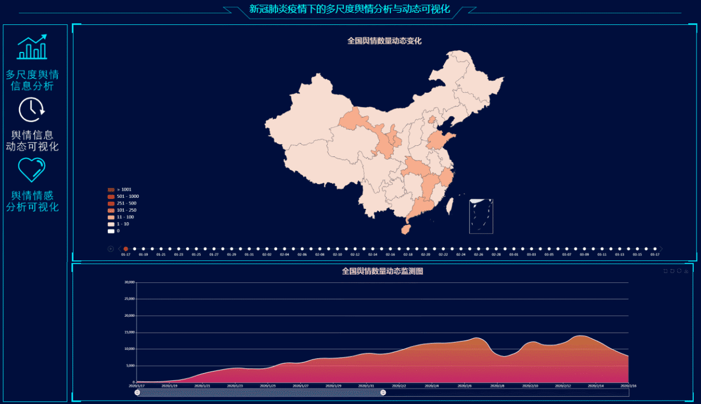
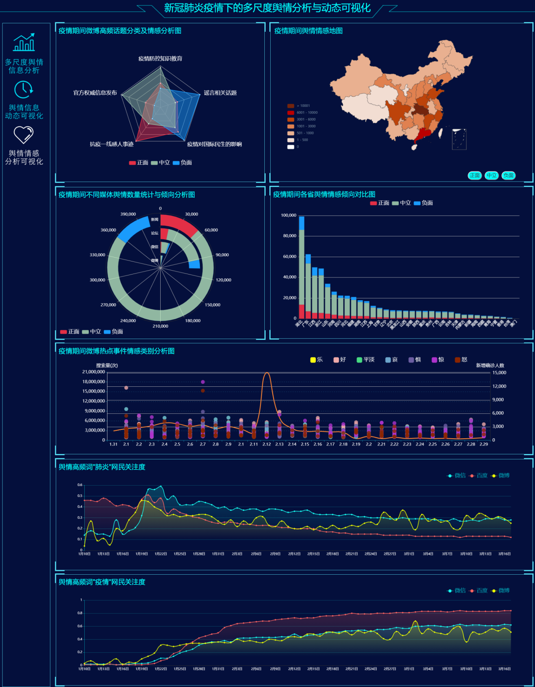

### 项目介绍

本项目是和课题组同门一起做的新冠肺炎疫情下的多尺度舆情分析及动态可视化系统。通过百度舆情平台、网络爬虫技术等获取新冠肺炎疫情相关的舆情数据，基于地图与地理信息技术将舆情信息与疫情发展情况进行多尺度对比与相关性分析，动态展现疫情期间网络舆情的时空变化过程，挖掘疫情相关热点事件，并基于信息图表对舆情情感等进行可视化。通过处理和分析疫情相关舆情数据，直观展现舆情态势、舆情焦点和情绪变化。

### 系统展示

#### 1. 多尺度舆情信息分析与可视化 

该主题使用交互功能展现疫情期间国家、省、市三个尺度下舆情信息的变化态势，将疫情发展与舆情态势进行关联分析，解析舆情焦点。主要包括全国、省、市多尺度下舆情数量分布图、每日新增病例数与舆情数量关系图、舆情高频词分析图、舆情词云。

    

#### 2. 舆情信息动态可视化  

该主题主要展现疫情期间舆情信息数量的空间分布特征及动态变化情况，为用户了解疫情期间每日舆情态势提供参考。主要包括全国舆情数量动态变化图、全国舆情数量动态监测图。

    

#### 3.舆情情感分析可视化

该主题主要展现新冠肺炎疫情下舆情情感特征、高频话题分析及网民关注度对比。主要包括疫情期间各省舆情情感倾向对比图、 疫情期间微博高频话题分类及情感分析图、疫情期间微博热点事件情感类别分析图、不同媒体舆情数量统计与倾向分析图、舆情高频词网民关注度对比图。

    

